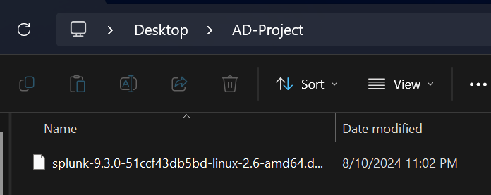
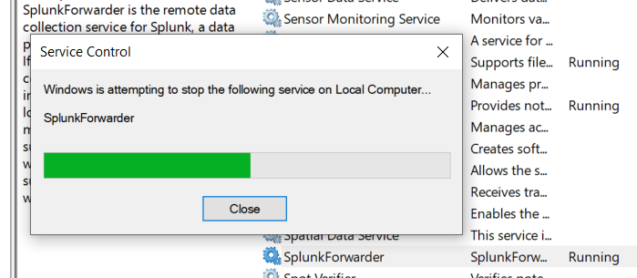
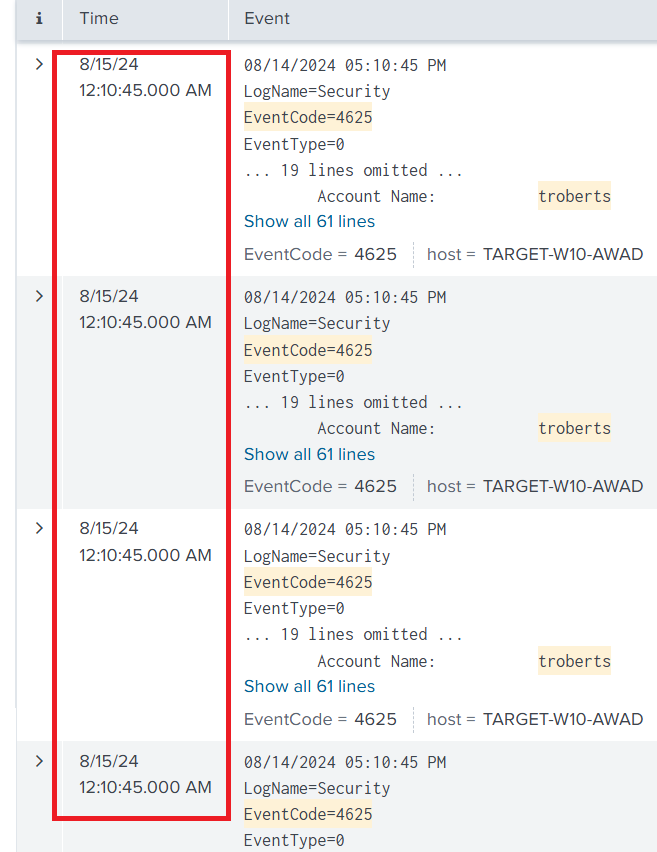
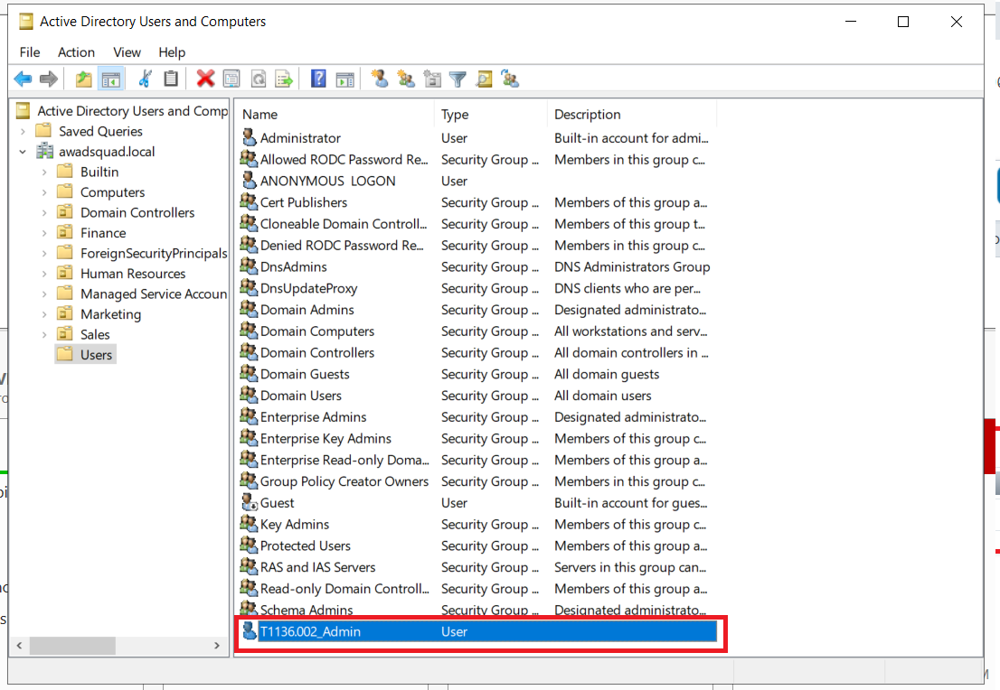

# Building a Comprehensive Security Home Lab: Active Directory, Splunk SIEM, and Threat Simulation
## Objective

This is a writeup to document my work on [MyDFIR's Active Directory project](https://www.youtube.com/watch?v=5OessbOgyEo).
The objectives of this project are to: build a functional domain environment with Active Directory, build a Splunk SIEM and
install Sysmon + telemetry forwarders on appropriate devices, and
simulate multiple attacks against a Windows 10 target and query those
security events in Splunk. A visual diagram of the logical topology was created using draw.io.

I will use VirtualBox to install and configure 4 virtual machines: an
Ubuntu server that will host Splunk, a Windows server acting as the
Domain Controller, a target Windows 10 machine that will also join the
Domain, and an attacker Kali Linux machine. I will install Sysmon and a
Splunk Universal Forwarder on the AD server and Windows machine to send
data to the Splunk server.

Using Kali Linux, I will also simulate a Brute Force attack against the
Windows 10 Target machine to generate security events and query those
logs in Splunk. Finally, I will install Atomic Red Team on the Windows
10 machine to run tests to see if our current Splunk logging settings
can pick up and log various attacks.

## Skills Practiced

Virtualization and Network Configuration

Installing Splunk Enterprise on a CLI based Ubuntu server to serve as a SIEM
platform

Installing a Splunk Universal Forwarder on Windows machines to send
telemetry data to the Splunk server

Configuring Splunk to receive and index logs, including the creation of
a new index

Configuring a Windows Server as an Active Directory Domain
Controller

Creating and managing a new domain, including the creation of
organizational units and user accounts

Connecting a different computer to the domain

Generating security events to be analyzed in Splunk

Simulating a Brute Force attack using Crowbar

Identifying malicious patterns and understanding event codes

Installing and running Atomic Red Team (ART) tests to simulate various
attack techniques aligned with the MITRE ATT&CK framework

Identifying potential gaps in security

Addressing challenges related to network connectivity, permissions, and
software installation across different virtual machines

Verifying the success of many different configurations ensuring that all
components function as intended within this lab environment

## Method

### The Diagram

Before anything is installed and configured, I created a visual diagram
of the logical topology, to have a reference on how the domain will be
constructed and how data will flow between systems.

### Installing the Virtual Machines

I already have Kali Linux installed. The other 3 machines remain: the
target Windows 10 machine and the two servers.

I've never installed a Windows Server before, but the process seemed to
be exactly like other Windows machines, just following prompts.

And similarly for the Ubuntu server, it's following prompts, hitting
done, and creating an account.

So now there are 4 machines ready to be used: an Ubuntu Splunk server, a
Windows server for AD, a target Windows 10 machine, and an attacker Kali
Linux machine.

### Creating the Network

I created a NAT Network in VirtualBox that all the machines will be
connected to, the IPv4 prefix is changed to match what I had planned in
the diagram. Then, I verify it works by logging into a machine and
checking the ip address.

I had assigned static IPs for all machines except for the Windows 10
machine, so these will be configured.

#### Splunk Server

For the Ubuntu Splunk server, I can disable DHCP with the command **sudo
nano /etc/netplan/00-installer-config.yami** and set DHCP4 to false.
Then, I can assign the static IP by creating a new line called
"**addresses:**" and entering in the right address. I also assign
Google's DNS server and configure the route to use the default route via
the gateway 192.168.0.1 .

Verifying the ip address and connectivity shows that everything is
working nicely.

#### Active Directory Server 

I assign the correct static IP for this machine by going into Control
Panel \> Network and Internet \> Network Connections \> Properties of
the correct adapter \> Properties of TCP/IP4 .

Then, I verify for the correct address and connectivity. After that, I
changed the hostname of this machine to AD-WS22-Awad.

#### Windows 10 Target Machine

This machine is already supposed to have a DHCP assigned IP address, but
I still double check and see if there are any conflicts. Checking with
**ipconfig** shows no conflicts, and I also verify connectivity, so
there is nothing to change regarding network settings. The only thing I
will change here is the hostname of the PC to "Target-W10-Awad".

#### Kali Linux Attacking Machine

For this machine, I can just right click on the network icon, edit
connections, move to the IPv4 tab, and change the method to manual. From
there, I add in the correct IP address, mask, gateway, and DNS server.
The address and connectivity to the internet is verified.

### Setting Up the Splunk Server

After downloading the Linux version of Splunk Enterprise on my host
machine, I have to work with VirtualBox a bit to install it on the
Ubuntu server.

I installed VBox's guest packages with **sudo apt-get install
virtualbox-guest-additions-iso** and **virtualbox-guest-utils** . Then I
added a shared folder, containing the splunk installation file, between
my host machine and the Ubuntu virtual machine and added my user to a
group called "vboxsf" to allow it to access those shared folders.
Finally, I mount the shared folder to a directory I created and the
splunk installation file shows up.

Finally, I installed Splunk with **sudo dpkg -i splunk** and hit tab to
autocomplete the long file name.

Once it's finished installing, I switch over to the "splunk" user and
run the binary ./splunk . Then, a command is entered to autorun Splunk
everytime this server is rebooted

Finally, I log onto another machine to verify that it was set up
properly by connecting to 192.168.10.10:8000

### Installing Sysmon and Universal Forwarder (UF)

The Windows 10 target and Active Directory server will have Sysmon and a
UF to send telemetry to the Ubuntu Splunk server. The process is
identical between the two machines, so I just documented the process for
the Windows 10 machine.

Because these machines aren't locked to a CLI, I don't have to set
shared folders between my host machine and these virtual machines in
order to install these services.

Downloading and running the UF from Splunk's website was trivial,
following prompts, and making sure to put in the Ubuntu system's ip
address as the "Receiving Indexer".

Next, I download Sysmon from the Microsoft website, and I download the
olafhartong config. I use powershell to run Sysmon.exe with olaf's
config.

An **inputs.conf** file will be added to tell the UF what to send over
to the Splunk server. Application, Security, and System logs that, I
believe, you would normally see in Windows Event Viewer will be sent
over as well as Sysmon logs. The UF service is restarted to have these
changes applied.

Finally, after all this set up, the SIEM can start being used properly.
I added a new index called "endpoint" because that is where the logs are
being sent to. Then, I set up receiving logs from the forwarder by
adding the default port that was listed in the UF's installation wizard

Now, I can already start seeing logs being collected by the machine when
I enter the Search and Reporting app and searching for index=endpoint

I repeat the same steps for the Active Directory server and verify that
logs are being sent from the machine.

### Building the Domain

After installing 'Active Directory Domain Services', the Windows Server
is promoted to be a domain controller and a brand new
domain(awadsquad.local) is constructed.

### 

I'll also create a couple organizational units within the domain and add
some users.

### Joining the Domain on a Different Computer

Now, I can switch over to the Windows 10 machine and join the domain,
authenticating as Terry Roberts. However, I need to change the DNS
server that this machine contacts, to the Domain Controller. This is
because the current DNS server does not know what awadsquad.local is.
So, it's changed to the ip address of the Windows Server.

Now, I can authenticate the action using Terry Roberts's credentials.

Now I can login to the machine with any of the users I created.

I also set a policy to restrict Control Panel access to members of the
Finance unit just to verify that everything is working correctly.

### Brute Forcing RDP on a Domain User

With RDP enabled on the Windows 10 machine (with all appropriate users
added), Crowbar is installed on Kali Linux and is the tool used to Brute
Force login credentials with the rockyou wordlist.

There are \~14 million lines in this text file. For the sake of this
project, the first 20 will be copied over, but the general principle of
using a wordlist applies. I also added the real password for Terry
Roberts just so the Brute Force attempt succeeds.

I set Crowbar to brute force RDP on every IP address within
192.168.10.0/24 just to see if I could and it actually worked. However,
this is obviously not ideal for an attacker and would be very messy,
setting off a ton of alarms. A better trained ethical hacker could
enumerate the hosts more efficiently to find out which target he wants.
You can see that each attempt took around 5-10 seconds, so a full /24
subnet would take around 20-40 minutes

### Querying the Brute Force Events

Logs generated while the Splunk server was offline were not lost to the
void. They were still able to make it to Splunk once it was booted up. I
can already see some telemetry being generated regarding troberts and
the Kali machine. The timeline is set to the last 15 minutes.

In the EventCode field, I can see two listings. My wordlist had 20
incorrect passwords and 1 correct password, and I also ran Crowbar twice
on the target machine. Because of this, it's clear that code 4625 means
a failed login attempt, and 4624 means a successful login attempt. I can
also google what the event code means.

Another good thing to look out for is the time of all these
login-related events. In this screenshot, you can see 4 failed login
attempts within one second. This is an indicator for Brute Force
activity.

### 

### Testing Our Security with Atomic Red Team

The final part of this project involves using ART to run
mini-penetration tests and see if Splunk can catch the related logs. I
install ART with Atomic Tests using powershell with the commands:

**IEX (IWR
\'https://raw.githubusercontent.com/redcanaryco/invoke-atomicredteam/master/install-atomicredteam.ps1\'
-UseBasicParsing);**

and

**Install-AtomicRedTeam -getAtomics**

In the Atomics folder, there are techniques that correlate with most of
the MITRE ATT&CK framework. I will test out persistence techniques
Creating a Local and Domain account - T1136.001 and T1136.002.

Back in powershell, the command **Invoke-AtomicTest** allows a test to
be conducted. I will run both .001 and .002 tests.

And telemetry was already generated and sent to splunk. For the first
test, I can organize the events involving "NewLocalUser" and count them
by their event code. Looking up the event codes on google shows that
account management steps such as enabling, resetting passwords, and
deleting users were performed.

And telemetry for the Domain Account technique shows an account was
created, verified by checking the list of users on the Domain Controller

I can see that the new account even has administrator privileges which is
pretty scary.

I also tried the Execution technique T1059.001. Alerts immediately
started appearing on the screen, with powershell prompts saying "Access
Denied" and Windows Defender detecting some threats.

After the full test was completed, I skimmed through some of the outputs
and noticed that T1059.001-6 showed some command it tried to execute but
failed.

I looked up a fragment of the command and it did end up showing in
Splunk. Very useful.

So far, all the tests I ran ended up generating logs that were sent to
Splunk. This means that there are good alerts that are being generated
with these types of malicious actions. However, Atomic Red Team may have
some tests that don't end up generating events in Splunk which means
that there are blind sides in our security. From there, steps could be
taken to detect and secure against those kinds of activities.
